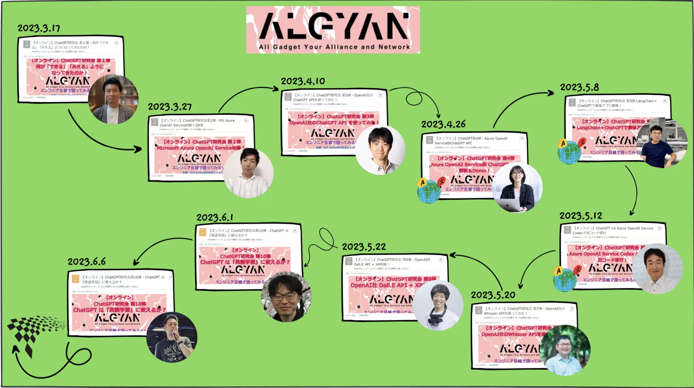

## ChatGPT研究会シリーズ2023

2023年の3月から6月にかけて<b>「ChatGPT研究会シリーズ」</b>を全10回にわたって開催しました！
華麗に素敵なコーディネータを担当された[ジョンさん](https://twitter.com/motoJinC25)に拍手ッ！👏👏👏

【PR】ジョンさんが牽引されている「株式会社モトジン・ドット・コム」の紹介はコチラから！  
[https://www.motojin.com/ja-jp](https://www.motojin.com/ja-jp)

本ページでは、10連弾のイベントのYouTubeアーカイブやスライド資料を一挙にまとめてご紹介します。  
「ChatGPT元年」といえる2023年、シリーズ開催中も怒涛の進化を見せていたChatGPTの上半期における現在地を俯瞰できるかも？？

### イベント一覧

- [2023年3月17日開催！ 第1弾：何が「できる」「みえる」ようになってきたのか！](#part1)
- [2023年3月27日開催！ 第2弾：MS Azure OpenAI Service始動！](#part2)
- [2023年4月10日開催！ 第3弾：OpenAI社のChatGPT APIを使ってみた！](#part3)
- [2023年4月26日開催！ 第4弾：Azure OpenAI Service版ChatGPT API](#part4)
- [2023年5月08日開催！ 第5弾：LangChain＋ChatGPTで最強アプリ開発！](#part5)
- [2023年5月12日開催！ 第6弾：Azure OpenAI Service Codexで旧コード移行](#part6)
- [2023年5月20日開催！ 第7弾：OpenAI社のWhisper APIを使ってみた！](#part7)
- [2023年5月22日開催！ 第8弾：OpenAI社 Dall.E API + XR技術！](#part8)
- [2023年6月01日開催！ 第9弾：MSの専門家がVisual ChatGPTを深掘り解説！](#part9)
- [2023年6月06日開催！ 第10弾：ChatGPT は『英語学習』に使えるか？](#part10)
- [番外編：ALGYAN8周年祭2023『生成AIで産業革命→どうなるIoT、どうする技術者！』](#8th)

### 第1弾：何が「できる」「みえる」ようになってきたのか！

#### connpassイベントページ

[2023年3月17日(金)開催！](https://algyan.connpass.com/event/276959/)

#### 発表者（敬称略）

<b>鄭 鎮健 (ジョン ジンゴン)</b>

 

<a href="https://mvp.microsoft.com/en-us/PublicProfile/5004337" rel="nofollow">Microsoft MVP for IoT</a> 
<a href="https://motojin.com" rel="nofollow">株式会社モトジン・ドット・コム</a> 代表取締役

2015年にDevOps開発手法研究のために起業と<a href="https://www.microsoft.com/en-us/startups" rel="nofollow">Microsoft for Startups</a>プログラムに採択。 
Edge AIリアルタイム画像処理パイプライン作成ツール<a href="https://github.com/motojinc25/WeDX" rel="nofollow">WeDX</a>をオープンソースとして公開。 
- Twitter: <a href="https://twitter.com/motojinc25" rel="nofollow">@motojinc25</a>

#### YouTubeアーカイブ

<iframe width="560" height="315" src="https://www.youtube.com/embed/fzQZPN2PFEo" title="YouTube video player" frameborder="0" allow="accelerometer; autoplay; clipboard-write; encrypted-media; gyroscope; picture-in-picture; web-share" allowfullscreen></iframe>

#### スライド資料

<iframe src="https://www.slideshare.net/slideshow/embed_code/key/mRMN4Br1zXr40e?startSlide=1" width="597" height="486" frameborder="0" marginwidth="0" marginheight="0" scrolling="no" style="border:1px solid #CCC; border-width:1px; margin-bottom:5px;max-width: 100%;" allowfullscreen></iframe>
<strong><a href="https://www.slideshare.net/JingunJung/chatgpt-256635152" title="ChatGPT、 何が「できる」「みえる」ようになってきたのか！" target="_blank">ChatGPT、 何が「できる」「みえる」ようになってきたのか！</a></strong> from <strong><a href="https://www.slideshare.net/JingunJung" target="_blank">Jingun Jung</a></strong>

[イベント一覧に戻る](#イベント一覧)

### 第2弾：MS Azure OpenAI Service始動！

#### connpassイベントページ

[2023年3月27日(月)開催！](https://algyan.connpass.com/event/277901/)

#### 発表者（敬称略）

<b>蒲生 弘郷(がもう ひろさと)</b>

 
日本マイクロソフト株式会社 クラウドソリューションアーキテクト(Data&amp;AI) 

大手システムインテグレータにてキャリアをスタート。 
自動車業界のDMSデータ活用基盤のコンサルティングおよび開発や、エンタープライズブロックチェーンを活用した異業種間データ流通プラットフォームの立ち上げなどを担当。 
数年間、データサイエンティストとして社会インフラ関連企業を対象にしたデータ分析および機械学習システムの開発を経て、現在はソリューションアーキテクトとしてAI導入の技術支援などに従事。

#### YouTubeアーカイブ

<iframe width="560" height="315" src="https://www.youtube.com/embed/eXJ4LLDax_8" title="YouTube video player" frameborder="0" allow="accelerometer; autoplay; clipboard-write; encrypted-media; gyroscope; picture-in-picture; web-share" allowfullscreen></iframe>

#### スライド資料

[Microsoft 蒲生さん発表資料！](https://techmode.co.jp/images/ALGYAN_AzureOpenAI_LLM_20230327.pdf)

[イベント一覧に戻る](#イベント一覧)

### 第3弾：OpenAI社のChatGPT APIを使ってみた！

#### connpassイベントページ

[2023年4月10日(月)開催！](https://algyan.connpass.com/event/278155/)

#### 発表者（敬称略）

<b>田中 正吾</b>

 

<a href="https://mvp.microsoft.com/en-us/PublicProfile/5003114" rel="nofollow">Microsoft MVP for Mixed Reality</a>

2004年より屋号ワンフットシーバスでフリーランスとして活動。 
以後、FLASH制作を中心にインタラクティブコンテンツを主に行い現在に至る。 
最近ではWEBフロントエンドをベースにしながらも、情報とインターフェースが合わさるアプローチという視点でIoTやMixed Realityといった技術も取り入れながら活動しています。 
2023年現在、Microsoft MVP・IBM Champion。

#### YouTubeアーカイブ

<iframe width="560" height="315" src="https://www.youtube.com/embed/w0Rhh1bDF7I" title="YouTube video player" frameborder="0" allow="accelerometer; autoplay; clipboard-write; encrypted-media; gyroscope; picture-in-picture; web-share" allowfullscreen></iframe>

#### スライド資料

<iframe class="speakerdeck-iframe" frameborder="0" src="https://speakerdeck.com/player/dc6e7311b1d6412882f73bbad4ef59a7" title="ALGYAN ChatGPT研究会 第 3 弾" allowfullscreen="true" style="border: 0px; background: padding-box padding-box rgba(0, 0, 0, 0.1); margin: 0px; padding: 0px; border-radius: 6px; box-shadow: rgba(0, 0, 0, 0.2) 0px 5px 40px; width: 100%; height: auto; aspect-ratio: 560 / 315;" data-ratio="1.7777777777777777"></iframe>

[イベント一覧に戻る](#イベント一覧)

### 第4弾：Azure OpenAI Service版ChatGPT API

#### connpassイベントページ

[2023年4月26日(水)開催！](https://algyan.connpass.com/event/278386/)

#### 発表者（敬称略）

<b>Mijeong JEON (チョン・ミジョン) - 韓国</b>

 
<a href="https://mvp.microsoft.com/en-us/PublicProfile/5003262" rel="nofollow">Microsoft MVP for AI</a>  
韓国・株式会社IDEAMP CTO 
韓国・Keras Koreaコミュニティー運営委員 
Youtube「<a href="https://www.youtube.com/@AI-io3ik" rel="nofollow">フレンドリーなAI(친절한 AI)</a>」チャネル運営

#### YouTubeアーカイブ

<iframe width="560" height="315" src="https://www.youtube.com/embed/zNcPxILhmjU" title="YouTube video player" frameborder="0" allow="accelerometer; autoplay; clipboard-write; encrypted-media; gyroscope; picture-in-picture; web-share" allowfullscreen></iframe>

[イベント一覧に戻る](#イベント一覧)

### 第5弾：LangChain＋ChatGPTで最強アプリ開発！

#### connpassイベントページ

[2023年5月8日(月)開催！](https://algyan.connpass.com/event/278998/)

#### 発表者（敬称略）

<b>Taeyoung Kim - 韓国</b>

 
Microsoft RD and MVP 
韓国・AIFactory CEO 
韓国・Keras Korea and Kaggle Korea 管理者 
書籍「블록과 함께 하는 파이썬 딥러닝 케라스(ブロック付きのPythonディープラーニングケラス)」著者

#### YouTubeアーカイブ

<iframe width="560" height="315" src="https://www.youtube.com/embed/Nv9ee63OVyE" title="YouTube video player" frameborder="0" allow="accelerometer; autoplay; clipboard-write; encrypted-media; gyroscope; picture-in-picture; web-share" allowfullscreen></iframe>

[イベント一覧に戻る](#イベント一覧)

### 第6弾：Azure OpenAI Service Codexで旧コード移行

#### connpassイベントページ

[2023年5月12日(金)開催！](https://algyan.connpass.com/event/278441/)

#### 発表者（敬称略）

<b>YoungWook Kim - 韓国</b>

 
<a href="https://mvp.microsoft.com/en-us/PublicProfile/33796" rel="nofollow">Microsoft MVP for Azure MVP 2021~</a> 
韓国Hello AI株式会社 代表取締役 
 
元Microsoft MVP for <a href="http://ASP.NET" rel="nofollow">ASP.NET</a> 2006～2008 
元韓国Microsoftプラットフォーム事業部 Technical Evangelist Software Engineer 
元韓国Microsoft 公共事業部 Account Technology Strategist Microsoft Certificate Trainer 

著書 
「<a href="https://product.kyobobook.co.kr/detail/S000001535600" rel="nofollow">最も早く出会うチャットボットプログラミング</a>」出版 
「<a href="https://product.kyobobook.co.kr/detail/S000001792776" rel="nofollow">War of IT</a>」出版

#### YouTubeアーカイブ

<iframe width="560" height="315" src="https://www.youtube.com/embed/Nv9ee63OVyE" title="YouTube video player" frameborder="0" allow="accelerometer; autoplay; clipboard-write; encrypted-media; gyroscope; picture-in-picture; web-share" allowfullscreen></iframe>

[イベント一覧に戻る](#イベント一覧)

### 第7弾：OpenAI社のWhisper APIを使ってみた！

#### connpassイベントページ

[2023年5月20日(土)開催！](https://algyan.connpass.com/event/278443/)

#### 発表者（敬称略）

<b>豊田陽介（@youtoy）</b>

 
プライベートで、いろいろ活動中（技術コミュニティ・モノ作り関連、書籍・技術雑誌の記事執筆、子ども向けの活動など）。 
ガジェットや面白そうな技術が好きです。2023年3月現在、Microsoft MVP。 
Twitter :  <a href="https://twitter.com/youtoy" rel="nofollow">https://twitter.com/youtoy</a>  
Qiita :  <a href="https://qiita.com/youtoy" rel="nofollow">https://qiita.com/youtoy</a>

#### YouTubeアーカイブ

<iframe width="560" height="315" src="https://www.youtube.com/embed/qwkVVz0D9NY" title="YouTube video player" frameborder="0" allow="accelerometer; autoplay; clipboard-write; encrypted-media; gyroscope; picture-in-picture; web-share" allowfullscreen></iframe>

#### スライド資料

<iframe class="speakerdeck-iframe" frameborder="0" src="https://speakerdeck.com/player/14c37fb0c811498fab5193a29451cfee" title="OpenAI社のWhisper APIを使ってみた！ / ChatGPT研究会 第7弾 (ALGYAN)" allowfullscreen="true" style="border: 0px; background: padding-box padding-box rgba(0, 0, 0, 0.1); margin: 0px; padding: 0px; border-radius: 6px; box-shadow: rgba(0, 0, 0, 0.2) 0px 5px 40px; width: 100%; height: auto; aspect-ratio: 560 / 315;" data-ratio="1.7777777777777777"></iframe>

[イベント一覧に戻る](#イベント一覧)

### 第8弾：OpenAI社 Dall.E API + XR技術！

#### connpassイベントページ

[2023年5月22日(月)開催！](https://algyan.connpass.com/event/278599/)

#### 発表者（敬称略）

<b>宮浦 恭弘</b>

 

<a href="https://mvp.microsoft.com/en-us/PublicProfile/5003104" rel="nofollow">Microsoft MVP for Mixed Reality</a>

HoloLensがきっかけでXRに興味を持ち、 
大阪駆動開発コミュニティなどでXR技術の探求を楽しみながら日々を過ごすエンジニア

#### YouTubeアーカイブ

<iframe width="560" height="315" src="https://www.youtube.com/embed/8fHNrEHK8ek" title="YouTube video player" frameborder="0" allow="accelerometer; autoplay; clipboard-write; encrypted-media; gyroscope; picture-in-picture; web-share" allowfullscreen></iframe>

#### スライド資料

<iframe src="https://www.docswell.com/slide/KYW13R/embed" allowfullscreen="true" class="docswell-iframe" width="620" height="405" style="border: 1px solid #ccc; display: block; margin: 0px auto; padding: 0px; aspect-ratio: 620/405;"></iframe>

[イベント一覧に戻る](#イベント一覧)

### 第9弾：MSの専門家がVisual ChatGPTを深掘り解説！

#### connpassイベントページ

[2023年6月1日(木)開催！](https://algyan.connpass.com/event/279565/)

#### 発表者（敬称略）

<b>松崎 剛 (まつざき つよし)</b>

 
 日本マイクロソフト株式会社 パートナー事業本部 クラウドソリューションアーキテクト 

日本マイクロソフトに 2005 年に入社。趣味の一環として、マインクラフト上で強化学習や模倣学習のプログラムを作成したり、など。 
- Blog: <a href="https://tsmatz.wordpress.com/" rel="nofollow">https://tsmatz.wordpress.com/</a>  
- GitHub: <a href="https://github.com/tsmatz" rel="nofollow">https://github.com/tsmatz</a>

#### YouTubeアーカイブ

<iframe width="560" height="315" src="https://www.youtube.com/embed/CAbla3Vsvac" title="YouTube video player" frameborder="0" allow="accelerometer; autoplay; clipboard-write; encrypted-media; gyroscope; picture-in-picture; web-share" allowfullscreen></iframe>

#### スライド資料

<iframe src="//www.slideshare.net/slideshow/embed_code/key/2y2EfCYEqbCZow" width="595" height="485" frameborder="0" marginwidth="0" marginheight="0" scrolling="no" style="border:1px solid #CCC; border-width:1px; margin-bottom:5px; max-width: 100%;" allowfullscreen> </iframe> 
 <strong> <a href="//www.slideshare.net/tsuyoshimatsuzaki16/20230601-iot-algyan-chatgpt9" title="2023/06/01 IoT ALGYAN ChatGPT研究会第9弾 資料" target="_blank">2023/06/01 IoT ALGYAN ChatGPT研究会第9弾 資料</a> </strong> from <strong><a href="//www.slideshare.net/tsuyoshimatsuzaki16" target="_blank">Tsuyoshi Matsuzaki</a></strong> 

[イベント一覧に戻る](#イベント一覧)

### 第10弾：ChatGPT は『英語学習』に使えるか？

#### connpassイベントページ

[2023年6月6日(火)開催！](https://algyan.connpass.com/event/280482/)

#### 発表者（敬称略）

<b>萩野 たいじ</b>

 
Microsoft MVP 
DatadogのSenior Technical Advocate 
 
元美容師で元音楽家。ソフトウェアエンジニアへ転身後、受託開発やパッケージ開発を経て有限会社アキュレートシステムを起業。 
その後、技術者へリーチしたマーケティング、DevRel（Developer Relations）の道へシフトし、MKI（三井情報）では初のTechnical Evangelistとなる。 
その経験を活かしIBMではUS本社組織のDeveloper Advocate Teamに所属し、Tokyo Teamの立ち上げをリード。 OutSystemsではLead Developer Community Advocateとして、APACのユーザーコミュニティとアドボカシーを担当した。筑波大学及び名城大学にて非常勤講師も務める。 
 
Microsoft MVP (2017-2019、2023) 
 
著書に「はじめてのNode-RED」「Node-RED活用マニュアル」「Practical Node-RED Programming」「開発者マーケティング DevRel Q&amp;A」「英語で広がる開発者のキャリア」など

#### YouTubeアーカイブ

<iframe width="560" height="315" src="https://www.youtube.com/embed/hHNKQJ3sKeU" title="YouTube video player" frameborder="0" allow="accelerometer; autoplay; clipboard-write; encrypted-media; gyroscope; picture-in-picture; web-share" allowfullscreen></iframe>

#### スライド資料

<iframe class="speakerdeck-iframe" frameborder="0" src="https://speakerdeck.com/player/6c8c364d6b2840fca02d7ca745671492" title="How to use ChatGPT for practicing English" allowfullscreen="true" style="border: 0px; background: padding-box padding-box rgba(0, 0, 0, 0.1); margin: 0px; padding: 0px; border-radius: 6px; box-shadow: rgba(0, 0, 0, 0.2) 0px 5px 40px; width: 100%; height: auto; aspect-ratio: 560 / 315;" data-ratio="1.7777777777777777"></iframe>

[イベント一覧に戻る](#イベント一覧)

### 番外編：ALGYAN8周年祭2023『生成AIで産業革命→どうなるIoT、どうする技術者！』

#### connpassイベントページ

[2023年5月27日(土)開催！](https://algyan.connpass.com/event/280147/)

#### YouTubeアーカイブ

<iframe width="560" height="315" src="https://www.youtube.com/embed/LFgrQTpkMbk" title="YouTube video player" frameborder="0" allow="accelerometer; autoplay; clipboard-write; encrypted-media; gyroscope; picture-in-picture; web-share" allowfullscreen></iframe>

[イベント一覧に戻る](#イベント一覧)

[homeに戻る](../index)
